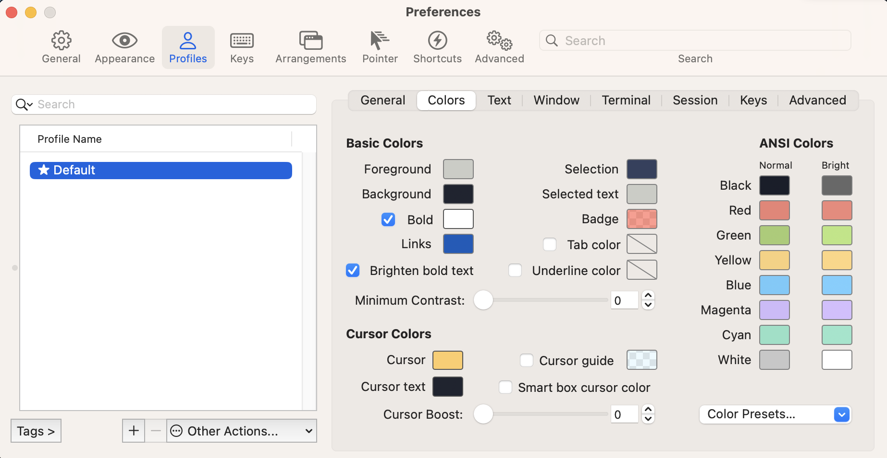

<center>
  <h1>
Mac OS Env
  </h1>
</center>


## 安装Brew

```shell
/bin/bash -c "$(curl -fsSL https://raw.githubusercontent.com/Homebrew/install/master/install.sh)"
```

安装完使用命令将brew添加到Env中。

```shell
(echo; echo 'eval "$(/opt/homebrew/bin/brew shellenv)"') >> /Users/evern/.zprofile
eval "$(/opt/homebrew/bin/brew shellenv)"
```

## 配置zsh

同Linux[配置zsh](../../Linux/Ubuntu/BasicEnv/README.md#配置zsh)

## 安装Scrcpy

```
brew install scrcpy
```

## 长按响应多次

```
defaults write -g ApplePressAndHoldEnabled -bool false
```

## ITerm2

### 下载

```
https://iterm2.com/downloads.html
```

### 主题

```
git clone https://github.com/mbadolato/iTerm2-Color-Schemes.git
cd iTerm2-Color-Schemes
./tools/import-scheme.sh schemes/*
```



右下角进行主题的选择。

## tmux

### 安装

```
brew install tmux
```

### .zshrc

```
# tmux
alias tn="tmux new -s"
alias ta="tmux a"
alias td="tmux detach"
alias tk="tmux kill-session -t"
alias tl="tmux list-session"
```

### .tmux.conf

```
set-option -g mouse on

bind -r k select-pane -U
bind -r j select-pane -D
bind -r h select-pane -L
bind -r l select-pane -R
```

