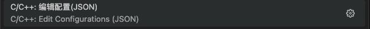
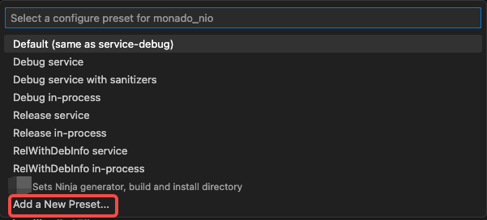

<center>
  <h1>
    VSCode & Android
  </h1>
</center>

## 简介

使用Vscode开发Android Native。

## 编译

### 修改C++配置

`shift + cmd + p`打开C++配置。



```json
{
    "configurations": [
        {
            "name": "Android",
            "includePath": [
                "${workspaceFolder}/**",
            ],
            "defines": [
            ],
            "compilerPath": "/Users/evern.zhu/Library/Android/sdk/ndk/21.4.7075529/toolchains/llvm/prebuilt/darwin-x86_64/bin/clang",
            "cStandard": "c17",
            "cppStandard": "c++17",
            "intelliSenseMode": "clang-x64",
            "configurationProvider": "ms-vscode.cmake-tools"
        }
    ],
    "version": 4
}
```

* 修改compilerPath为自己的clang路径

### 修改Cmake Preset


点击底部Configure Preset设置。



添加一个新的Preset。

**CMakePresets.json**

```
{
    "name": "evern",
    "displayName": "evern",
    "description": "Sets Ninja generator, build and install directory",
    "generator": "Ninja",
    "binaryDir": "${sourceDir}/out/build/${presetName}",
    "environment": {
        "ANDROID_NDK": "/Users/evern.zhu/Library/Android/sdk/ndk/21.4.7075529",
        "PATH": "/Users/evern.zhu/Library/Android/sdk/cmake/3.22.1/bin:$penv{PATH}"
    },
    "toolchainFile":"/Users/evern.zhu/Library/Android/sdk/ndk/21.4.7075529/build/cmake/android.toolchain.cmake",
    "cacheVariables": {
        "XRT_FEATURE_SERVICE": "ON",
        "EIGEN3_INCLUDE_DIR": "/Users/evern.zhu/Work/xr/openxr/eigen/eigen-3.4.0",
        "CMAKE_BUILD_TYPE": "Debug",
        "ANDROID_PLATFORM": "26",
        "ANDROID_ARM_NEON": "TRUE",
        "CMAKE_INSTALL_PREFIX": "${sourceDir}/out/install/${presetName}"
    }
}
```

### 选择Preset后编译


选择添加的Preset，点击Build进行编译。