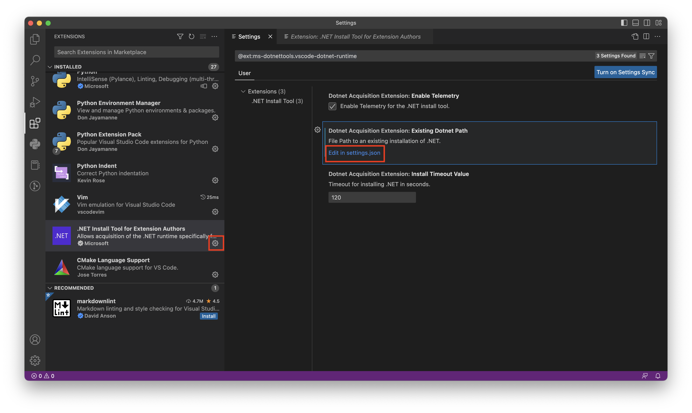
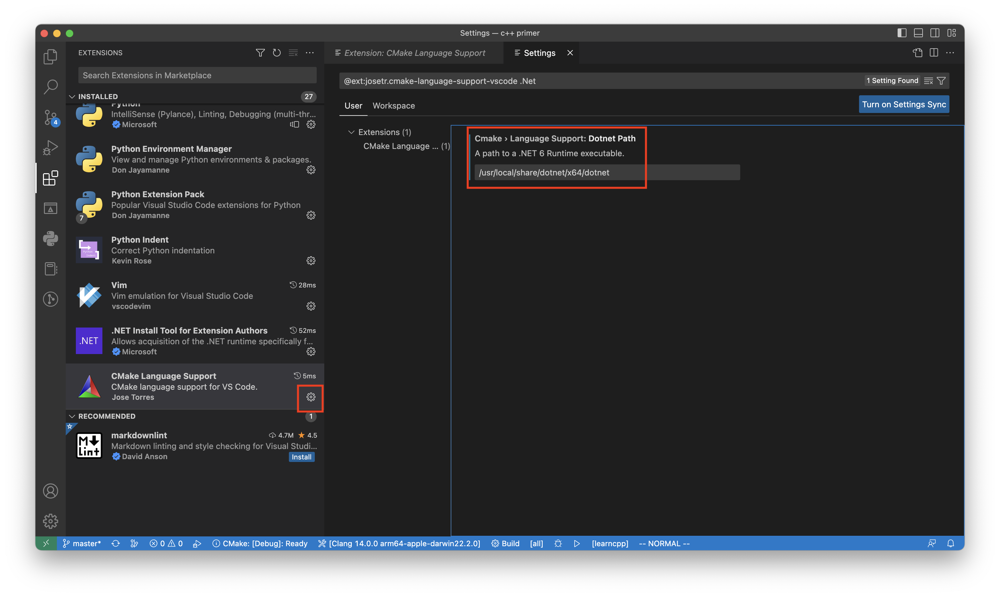

<center>
    <h1>
        Vscode CMake
    </h1>
</center>

## 安装CMake扩展

首选需要在扩展中安装**C/C++ Extension Pack**扩展。


为了使用CMake语言的代码补全还需要安装**CMake Language Support**扩展。


## 配置编译器

### Windows

这里整理了简单的步骤，也可以根据[官网](https://code.visualstudio.com/docs/cpp/config-mingw)给出的步骤进行配置。

#### 安装MSYS2

下载文件并安装，也可以去[官网](https://www.msys2.org/)获取最新版本。

| 安装文件                                                     | SHA256                                                       |
| ------------------------------------------------------------ | ------------------------------------------------------------ |
| [msys2-x86_64-20230127.exe](https://github.com/msys2/msys2-installer/releases/download/2023-01-27/msys2-x86_64-20230127.exe) | d05c0618027299e9a0834de968596c41bd2012ed8b2534b114a3b9d3fca56809 |

此处安装直接下一步，我唯一修改了安装的路径为`D:\program\msys64`

安装后打开**MSYS2**。


#### 安装 Mingw-w64 toolchain

打开**MSYS2**命令行，安装toolchain。

```powershell
pacman -S --needed base-devel mingw-w64-x86_64-toolchain
```


#### 安装 Mingw-w64 make & cmake

```powershel
 pacman -S mingw-w64-x86_64-make

 pacman -S mingw-w64-x86_64-cmake
```


#### 添加Mingw-w64 bin到系统Path


#### 测试编译器安装状态

打开**Powershell**输入命令，验证编译器安装状态。

```powershell
gdb --version
gcc --version
g++ --version
```


### MacOS

#### 安装cmake

```shell
brew install cmake
```

#### 安装.Net

下载.Net，这里使用的是.Net6.0的版本，由于Vscode安装时会因为权限问题报错，所以这里需要自己自行安装，可能在**Cmake Language Support**插件的详情中找到安装的网址。这里安装完，目录一般在`/usr/local/share/dotnet/x64/dotnet`。

| 安装文件                                                     | 安装文档                                                     |
| ------------------------------------------------------------ | ------------------------------------------------------------ |
| [SDK 6.0.406 x64](https://download.visualstudio.microsoft.com/download/pr/8a0c7611-7ca1-49d7-a889-e6514fc29dd0/08927286063140ccdf88eafe0e3bd2fb/dotnet-sdk-6.0.405-osx-x64.pkg) | [Install .NET on macOS](https://learn.microsoft.com/en-us/dotnet/core/install/macos) |

配置.Net的执行目录



将执行目录添加到配置文件中。

```json
{
    "cmake.configureOnOpen": true,
    "dotnetAcquisitionExtension.existingDotnetPath": [
        {"extensionId": "msazurermtools.azurerm-vscode-tools", "path": "/usr/local/share/dotnet/x64/dotnet"}
    ],
    "explorer.confirmDelete": false
}
```

将执行目录添加到**Cmake Language Support**配置中。




## CMake项目验证

### 创建HelloWorld

创建helloworld目录，并使用vscode打开。

```powershell
mkdir projects
cd projects
mkdir helloworld
cd helloworld
code .
```

### 编写代码

**helloworld.cpp**

```cpp
#include <iostream>
#include <vector>
#include <string>

using namespace std;

int main()
{
    vector<string> msg {"Hello", "C++", "World", "from", "VS Code", "and the C++ extension!"};

    for (const string& word : msg)
    {
        cout << word << " ";
    }
    cout << endl;
}
```

### 运行

选择编译器直接运行c++代码。


打印结果正常。说明编译器已经在Vscode中正常运行。

### 使用CMake运行

添加**CMakeLists.txt**

```cmake
cmake_minimum_required(VERSION 3.0)

project(helloworld)

add_executable(helloworld helloworld.cpp)
```


选择编译器并运行。


最终结果正确，Vscode的CMake环境配置完成。


## 问题

### ModuleNotFoundError: No module named 'encodeings'


**PYTHONHOME**设置的python路径和mingw64的python冲突报错，需要清除系统环境变量**PYTHONHOME**。或者将**PYHTONHOME**的python和gdb执行的python进行统一。