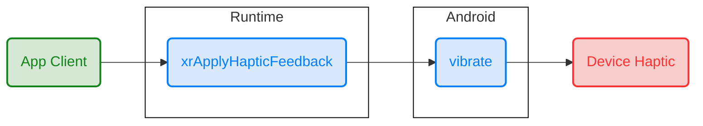

    <h1>
        OpenXR
    </h1>

## OpenXR 简介

XR对于对于很多人来说比较陌生，那XR是什么呢？OpenXR又是用来干什么的呢？

这里首先来说说这里的XR代表着什么。**XR其实就是AR，VR，MR的一个总称**。

> AR（Augmented Reality）增强显示：将现实场景和虚拟场景相结合的一种集成技术。通过将真实世界特定的画面或信息植入程序中，并对这些内容进行模拟、升级、补充、渲染，在应用AR技术的时候，这些被计算器处理的信息会在特定的场景被激发，与现实世界叠加，从而达到超越现实的感官体验。
>
> VR（Virtual Reality）虚拟现实：通过设备模拟一个完全虚拟的数字世界，通过VR眼睛和手柄等外设，能给使用者提供视觉、听觉等感官上的体验感。我们看到的一切场景和现实世界没有任何关联，所有的场景、事物都是由计算机生成的。
>
> MR（Mixed Reality）混合现实：MR是VR和AR的融合形态，能够将真实世界和虚拟世界进行融合，产生新的可视化环境。并且产生的虚拟动画能够和真实世界进行实时交互，而这是AR所不具备的。

官网对OpenXR的描述：

> OpenXR is a royalty-free, open standard that provides high-performance access to Augmented Reality (AR) and Virtual Reality (VR)—collectively known as XR—platforms and devices.

这里简单理解，OpenXR是一个免版税的，开放的标准，让应用能够更高效的使用AR和VR的平台和设备。

这里可能不能直观的了解OpenXR到底是用来干什么的，这里现有个简单的概念。**OpenXR是一套标准，定义了接口和使用方式，严格定义了每一个接口的功能，输入和输出，作用是让XR应用能够在XR平台或者设备上运行。**

### OpenXR的目的

首先来看当前的XR市场的情况，可以很明显的看到作为一个XR应用或者引擎的开发者，在当前XR市场群雄逐鹿的情况下，为了满足应用在多个平台上运行，需要应用基于多个平台的不同的SDK或者API进行不同的开发，大大加大了跨平台移植的难度和工作量，由于每一家的功能和能力不同，又会引入各种各样的问题。

在这种情况下作为开源标准制定组织中的老行家**khronos**在2019年提出了OpenXR这样的开放标准，来统一各个厂家的开发API。**目的是统一标准，简化移植的工作量，也能加快XR产业的发展。**

### 细说OpenXR

OpenXR作为应用和平台或者设备的桥梁，到底是怎么实现的？

这里将在不同的角度去阐述OpenXR的角色，分别是使用者OpenXR客户端，和实现者OpenXR平台端或者说是设备端。

#### OpenXR 客户端

作为应用端，当我们开发应用时，如果我们想在某个平台上运行，那么必须要知道这个平台开发的接口是什么。然后根据接口的规则定义进行应用的开发，那么OpenXR就是这套接口。OpenXR包含了开发者需要开发XR应用“所有”需要的平台接口函数。

> 由于目前不管是XR行业还是OpenXR都在快速发展中，所以很多系统新增的功能接口各家都在持续进行扩展和申请中，所以很多接口还是作为厂家独有的扩展进行使用，还没有合入OpenXR的公共接口中。

上图是OpenXR Demo中最基础的XR应用，此应用可以在支持OpenXR的所有平台上运行。其中有很多概念此处不做过多讲解，主要目的还是为了对OpenXR应用流程有一个简单的概念。

上面主要是看蓝色部分的函数名，这些函数就是由OpenXR进行定义的，确定了功能，输入和输出。作为一个成熟的工程师，相信大家看到这些函数名已经对OpenXR有一个大致的概念。如果你是一个应用开发工程师，你只需要**使用上述的API，并参照Demo使用的流程进行你的应用的开发，就能够使应用在OpenXR的平台上运行了**。

对于应用来说，应用调用了同样的API，在不同的OpenXR平台上，返回的结果和实现的功能也应该是一样的。

##### 总结

简单来说对于应用开发者，我们只需要知道OpenXR定义了一套标准的API接口，我们可以通过Spec了解每一个API的定义，使用方法，参数和返回结果。根据OpenXR的Demo我们可以知道如何将这些接口结合起来，编写出自己的XR应用。

> 这里其实是OpenXR Native的使用方法，对于更多的开发者来说，大家开发XR应用的时候，更多的是使用游戏引擎，可能不会涉及到这些函数的使用，因为这些函数的调用已经由游戏引擎以自己的实现方式进行调用了。后续会有文档对Unity的OpenXR使用进行分析，主要是介绍用OpenXR实现Unity的SubSystem，来实现Unity应用运行在OpenXR平台上。

#### OpenXR 平台端

**作为平台其实就是去实现由OpenXR定义的标准接口。**

##### OpenXR Runtimes

> ## OpenXR Runtimes
>
> Conformant implementations available for download:
>
> - Collabora: [Open source OpenXR implementation for a variety of headsets on Linux and other platforms](http://monado.dev/)
> - HTC: [OpenXR PC and Mobile support](https://developer.vive.com/resources/openxr/)
> - Microsoft: [OpenXR runtime for Windows Mixed Reality headsets](https://aka.ms/openxr)
> - Oculus: [OpenXR Mobile SDK](https://developer.oculus.com/downloads/package/oculus-openxr-mobile-sdk/), [OpenXR PC Support](https://developer.oculus.com/documentation/native/pc/dg-openxr)
> - SteamVR: [OpenXR runtime for all supported headsets on Windows](http://steamvr.com/)
> - Varjo: [OpenXR runtime for all supported Varjo headsets](https://developer.varjo.com/docs/openxr/openxr)
>
> More runtimes to follow soon!

官网上有目前支持的几个平台的网站，其中开源的有Collobora的monado可以进行参考，目前monado有尝试过在Linux和Android系统上进行运行。

##### Runtime详解

这里我会详细说说OpenXR的在Runtime中扮演的角色。

###### 基础实现

首先OpenXR只是一套标准的接口，那么Runtime就是实现这套标准接口的代码，如果是在Android中运行，那么Runtime就是使用Android中可用的接口去实现OpenXR的接口。

这里举一个最简单的例子，**xrApplyHapticFeedback**这个函数是用来进行振动反馈的，那么在Android端，我们要做的就是实现这个振动的函数，如果我们没有手柄，只是用手机做测试，那么我们需要用到Android的振动接口去实现。那么客户端在调用这个函数后，就会调用到Android的振动来实现功能。

如上图所示，Runtime就是按照OpenXR的标准去实现一个又一个的接口，当Runtime实现了所有的OpenXR的基础接口之后，那么一个普通的OpenXR应用就可以在设备上运行了。

这里最需要注意的是，一直在强调的规定了接口，参数和返回，返回也是有明确规定的。并不是所有执行的函数都是成功的，每一个函数失败的返回值都是由OpenXR严格规定的，什么错误返回什么值，是不可以随便修改的。

###### 扩展实现

之前讲的都是基础实现，其实由于各家的功能都有所不同，以及目前XR行业的快速发展，现有的接口已经不能完全满足目前很多平台的开发了，所以才有了扩展接口的出现。**扩展其实就是还没有被收录进OpenXR正式接口中，由各个公司提出的他们自己会实现的新的功能接口。**

> - [12.1. XR_KHR_android_create_instance](https://registry.khronos.org/OpenXR/specs/1.0/html/xrspec.html#XR_KHR_android_create_instance)
> - [12.30. XR_EXT_hand_tracking](https://registry.khronos.org/OpenXR/specs/1.0/html/xrspec.html#XR_EXT_hand_tracking)
> - [12.43. XR_FB_composition_layer_alpha_blend](https://registry.khronos.org/OpenXR/specs/1.0/html/xrspec.html#XR_FB_composition_layer_alpha_blend)
> - [12.72. XR_HTC_passthrough](https://registry.khronos.org/OpenXR/specs/1.0/html/xrspec.html#XR_HTC_passthrough)
> - [12.79. XR_META_vulkan_swapchain_create_info](https://registry.khronos.org/OpenXR/specs/1.0/html/xrspec.html#XR_META_vulkan_swapchain_create_info)
> - [12.80. XR_ML_ml2_controller_interaction](https://registry.khronos.org/OpenXR/specs/1.0/html/xrspec.html#XR_ML_ml2_controller_interaction)
> - [12.81. XR_MND_headless](https://registry.khronos.org/OpenXR/specs/1.0/html/xrspec.html#XR_MND_headless)
> - [12.82. XR_MSFT_composition_layer_reprojection](https://registry.khronos.org/OpenXR/specs/1.0/html/xrspec.html#XR_MSFT_composition_layer_reprojection)
> - [13.1. XR_EXTX_overlay](https://registry.khronos.org/OpenXR/specs/1.0/html/xrspec.html#XR_EXTX_overlay)

上面截取了部分新扩展的接口，可以看到扩展接口都是由固定格式的，以XR开头，中间是公司的简写，后面是新接口的名字，这里的名字并不是函数名，而是这个扩展的总的名称。

这些扩展到进入OpenXR的正式接口还需要一系列的步骤，由评审会最终根据各个标准确定是否需要添加该扩展，之后就会把扩展变成正式接口。

##### Runtime更多

这里一直以Runtime著称，但是其实OpenXR的接口还不足以满足一个完整商用应用的开发需求。很多接口其实OpenXR并没有去定义，也不应该在OpenXR中第一，比如说平台自有的成就系统，用户聊天系统，平台状态信息获取等等。所以这些其实还是需要平台自己去开发提供相应的接口。如果有机会可以分享一下Oculus目前提供的接口有哪些部分组成。

##### 总结

OpenXR平台端其实主要是去实现OpenXR的接口，完成他的功能。有些通用的功能并没有公共的接口，比如说手势，可以使用其他公司的扩展，亦或者是开发自己标准的接口，向Khronos去申请成为扩展，以便后续统一成公共的接口。

当然OpenXR平台端目前仅仅实现OpenXR的接口还远远不够，还是需要有更多的平台接口来完善用户体验。

## 总结

* OpenXR主要是为了统一各个平台不同的接口，方便平台移植提出的一套免税的标准接口。
* 对于应用开发者，OpenXR就是一套标准的接口，拿来用就可以开发XR应用了。
* 对于平台，就是需要去实现OpenXR的标准接口，来适配OpenXR应用。
* OpenXR的发展能大大加快XR行业的发展，为那些还没有内容的厂家提供更多的可能性。

## 相关资料

* [OpenXR官网](https://www.khronos.org/openxr/)
* [OpenXR Sample Code: OpenXR-SDK-Source](https://github.com/KhronosGroup/OpenXR-SDK-Source)
* [OpenXR Extension](https://registry.khronos.org/OpenXR/specs/1.0/styleguide.html)
* [OpenXR Specification](https://registry.khronos.org/OpenXR/specs/1.0/html/xrspec.html)

## 其他

> 第一次写这样的不会去开会讲解的文档，有很多地方不够清晰，写的也比较乱，有什么问题或者是建议的可以提issue，后续会进行回答和改进。
>
> 这里更多的是讲概念，后续的文章也会是这样，不会涉及太多的代码分析，最多也就是讲讲结构。一样是有问题可以提issue进行讨论。
